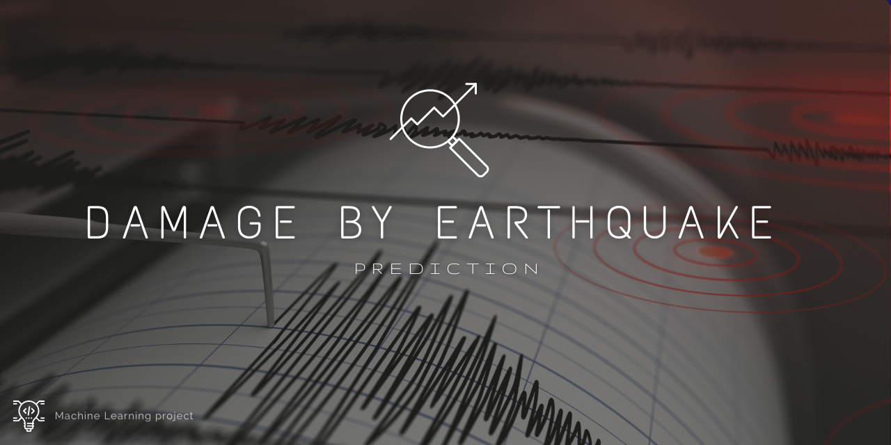

# Project03-earthquake-damage

# Overview

Following the 7.8 Mw Gorkha Earthquake on April 25, 2015, Nepal carried out a massive household survey using mobile technology to assess building damage in the earthquake-affected districts. Although the primary goal of this survey was to identify beneficiaries eligible for government assistance for housing reconstruction, it also collected other useful socio-economic information. In addition to housing reconstruction, this data serves a wide range of uses and users e.g. researchers, newly formed local governments, and citizens at large.

# Problem Description

We are trying to predict the ordinal variable damage_grade, which represents a level of damage to the building that was hit by the earthquake. There are 3 grades of the damage:
  

- represents low damage
- represents a medium amount of damage
- represents almost complete destruction

# Feature Description

The dataset mainly consists of information on the buildings' structure and their legal ownership. Each row in the dataset represents a specific building in the region that was hit by Gorkha earthquake.

Information about the features can be found here - https://www.drivendata.org/competitions/57/nepal-earthquake/page/136/
